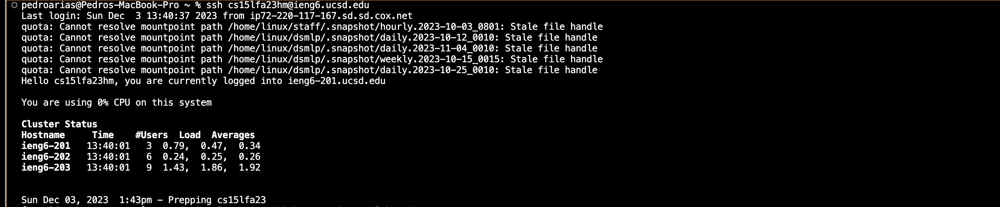
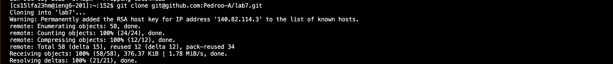
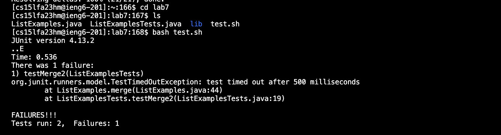
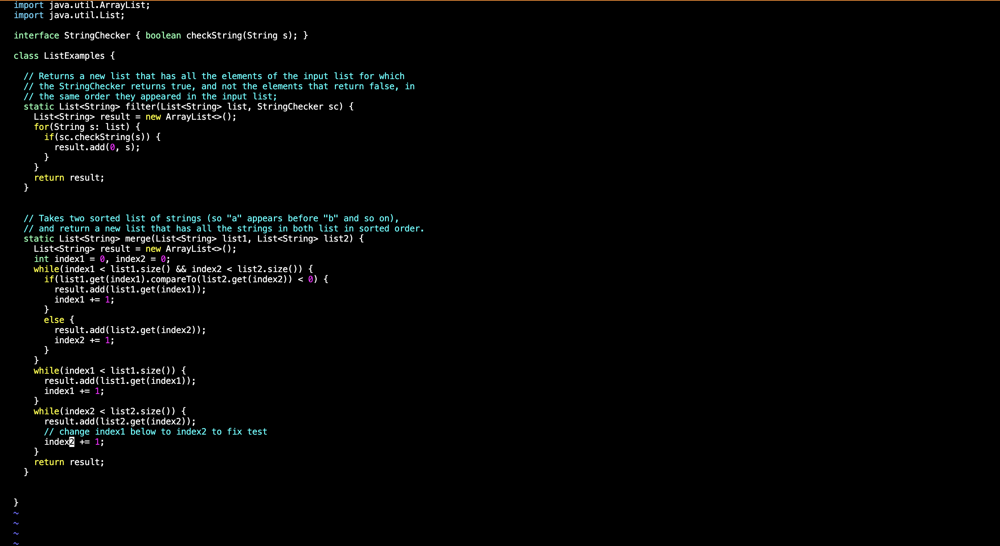
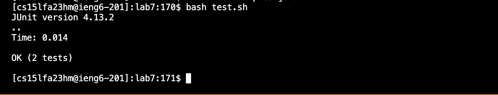
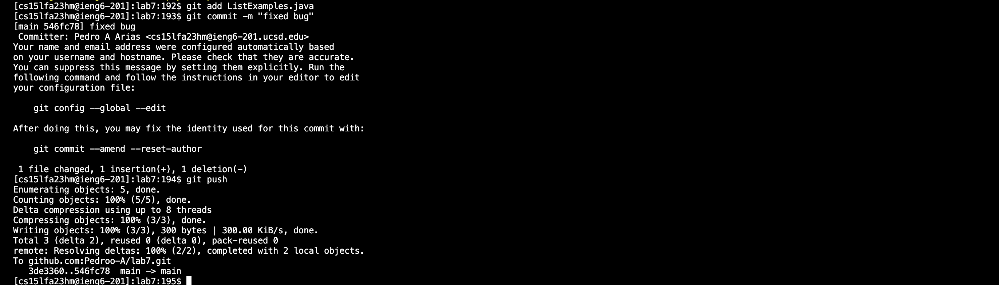

# Lab Report 4
## Baseline:  
Without any shortcuts and typing out every command, I managed a time of 4:02. Here is each command with key press I did:   
### Logging into ieng6

 *Keys Pressed:* `<s><s><h>, <s>
<a><c><e>, <c><s><1><5><l><f><a><2><3><h><m><@>i><e><n><g><6><.><u><c><s><d><.><e><d><u>, <enter>` 
I had to type out the entire command to log into ieng6 because I didn't use any shortcuts and had to write out the command. There were a lot of keypresses that I had to do that made the process lengthy  
### Git Cloning Repository
 
*Keys Pressed:* `<g><i><t>, <space>, <c><l><o><n><e>, <ctrl-v>, <enter>` 
While still needing to type out the beginning of the command which clones the lab7 repository onto my workspace. I used a shortcut `<ctrl-v` which pasted the ssh link of the repository so I could clone it. This saved me a lot of time as I didn't have to type out a full link which would take a lot longer.  
### First test
 
*Keys Pressed:* `<c><d>, <space>, <l><a><b><7>, <enter>, <l><s>, <enter>, <b><a><s><h>, <space>, <t><e><s><t><.><s><h>, <enter>` 
I used the cd command to enter the lab7 directory and ls to see the name of the test file in order to run it. This process took awhile as I needed to find the right name of the test file to run it so I had to input extra commands to find the name.  
### Ediing Code File
  
*Keys Pressed:* `<v><i><m>, <space>, <L><i><s><t><E><x><a><m>
<l><e><s><.><j><a><v><a>, <enter>` 
Using vim to access the code in ListExamples.java to fix the bug. It did not take long, but it could be shorter to not write out "ListExamples.java" 
 
*Keys Pressed:* `<up><up><up><up><up><up>, <right><right><right><right><right><right><right><right><right><right><right>, <r>, <2>, <shift><:><w><q>` 
After accessing "ListExamples.java" I naviagted using the up and right arrows to get to the bug, which was to replace `index1` with `index2`. So I used r which is a command in vim to replace an item that is selected by the cursor and I replaced the 1 to a 2 and saved/exited the file. Navigating through the vim file used a lot of key presses that took awhile to complete.  
### Running Working Tests

*Keys Pressed:* `<b><a><s><h>, <space>, <t><e><s><t><.><s><h>`
Rerunning tests to make sure the code works.  
### Committing and Pushing to Github
 
*Keys Pressed:* `<g><i><t>, <space>, <a><d><d>, <space>, <L><i><s><t><E><x><a><m>
<l><e><s><.><j><a><v><a>, <enter>`  `<g><i><t>, <space>, <c><o><m><m><i><t>, <space>, <-><m>, <space>, <"><f><i><x><e><d>, <space>, <b><u><g><">, <enter>`  `<g><i><t>, <space>, 
<u><s><h>, <enter>` 

Using `git add` to add ListExamples.java to be commited after debugging the code, then `git commit` to commit the changes to Github and finally using `git push` to push the change to Github, fixing the code. This process took a long time wihtout the use of shortcuts and a lot of key presses.  

Overall, the baseline took 4 minutes as a result of not using shortcuts and writing out every command was lengthy and there were a lot of uncessary key presses.    

---

## Speeding up the process
