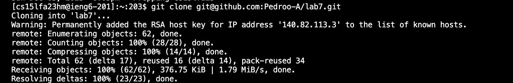

# Lab Report 4
## Baseline:  
Without any shortcuts and typing out every command, I managed a time of 4:02. Here is each command with key press I did:   
### Logging into ieng6

 *Keys Pressed:* `<s><s><h>, <s>
<a><c><e>, <c><s><1><5><l><f><a><2><3><h><m><@>i><e><n><g><6><.><u><c><s><d><.><e><d><u>, <enter>` 
I had to type out the entire command to log into ieng6 because I didn't use any shortcuts and had to write out the command.   
There were a lot of keypresses that I had to do that made the process lengthy  
### Git Cloning Repository
 
*Keys Pressed:* `<g><i><t>, <space>, <c><l><o><n><e>, <ctrl-v>, <enter>` 
While still needing to type out the beginning of the command which clones the lab7 repository onto my workspace.   
I used a shortcut `<ctrl-v>` which pasted the ssh link of the repository so I could clone it. This saved me a lot of time as I didn't have to type out a full link which would take a lot longer.  
### First test
 
*Keys Pressed:* `<c><d>, <space>, <l><a><b><7>, <enter>, <l><s>, <enter>, <b><a><s><h>, <space>, <t><e><s><t><.><s><h>, <enter>` 
I used the cd command to enter the lab7 directory and ls to see the name of the test file in order to run it.   
This process took awhile as I needed to find the right name of the test file to run it so I had to input extra commands to find the name.  
### Ediing Code File
  
*Keys Pressed:* `<v><i><m>, <space>, <L><i><s><t><E><x><a><m>
<l><e><s><.><j><a><v><a>, <enter>` 
Using vim to access the code in ListExamples.java to fix the bug.  
It did not take long, but it could be shorter to not write out "ListExamples.java" 
 
*Keys Pressed:* `<up><up><up><up><up><up>, <right><right><right><right><right><right><right><right><right><right><right>, <r>, <2>, <shift><:><w><q>` 
After accessing "ListExamples.java" I naviagted using the up and right arrows to get to the bug, which was to replace `index1` with `index2`. So I used r which is a command in vim to replace an item that is selected by the cursor and I replaced the 1 to a 2 and saved/exited the file. 
  Navigating through the vim file used a lot of key presses that took awhile to complete.  
### Running Working Tests

*Keys Pressed:* `<b><a><s><h>, <space>, <t><e><s><t><.><s><h>, <enter>`
Rerunning tests to make sure the code works.  
### Committing and Pushing to Github
 
*Keys Pressed:* `<g><i><t>, <space>, <a><d><d>, <space>, <L><i><s><t><E><x><a><m>
<l><e><s><.><j><a><v><a>, <enter>`  `<g><i><t>, <space>, <c><o><m><m><i><t>, <space>, <-><m>, <space>, <"><f><i><x><e><d>, <space>, <b><u><g><">, <enter>`  `<g><i><t>, <space>, 
<u><s><h>, <enter>` 

Using `git add` to add ListExamples.java to be commited after debugging the code, then `git commit` to commit the changes to Github and finally using `git push` to push the change to Github, fixing the code.
 This process took a long time wihtout the use of shortcuts and a lot of key presses.  

Overall, the baseline took 4 minutes as a result of not using shortcuts and writing out every command was lengthy and there were a lot of uncessary key presses.    

---

## Speeding up the process  
Using Shortcuts to complete the task, I managed a time of 1:22, Here is each command and key press I did:   
### Logging into ieng6

 *Keys Pressed:* `<up>, <enter>`  
Using ssh to remotely connect to ieng6, I managed to complete it in two key presses. 
 Since logging into ieng6 was the last command I did on my personal computer, it was the first one in the history so I used the up arrow to access it. This took a lot less time as it only took around 2 seconds rather than the 15 that it took without shortcuts   
### Git Cloning Repository
 
*Keys Pressed:* `<ctrl><r>, <g><i><t>,  <enter>` 
Using the `git clone` command to clone the lab7 repository into my workspace.  
Since using this command was in my recent history, I used `<ctrl><r>` to find the command in the bash history and accessed and ran it. This made cloning a lot faster as I spent less time and key presses to clone the repository.   
### First test
 
*Keys Pressed:* `<c><d>, <space>, <l><a><b><7>, <enter>, <ctrl><r><b><a>, <enter>` 
I used `cd` to make the working directory lab7, then using a bash script named "test.sh" I tested the code which resulted in a failure. 
 I moved into the lab7 directory normally through the cd command, however I used `<ctrl><r>` again to find the bash command that was in the history to run the test script and ran it. This made the process a lot faster than what it would normally take as not as many keystrokes were made.  
### Ediing Code File
  
*Keys Pressed:* `<v><i><m>, <tab><.><tab>, <enter>` 
Using vim to access the code in ListExamples.java to fix the bug. I first typed in vim to access the command, then I pressed `<tab>` so that the terminal would autocomplete it. Since there were multiple files that started with "ListExamples" it autofilled that, to further autocomplete it I pressed `<.>` and then `<tab>`. This also severely made my time faster as I didn't have to complete the entire command and just had it autofilled.  
 
*Keys Pressed:* `<shift><:><44>, <right><right><right><right><right>, <r>, <2>, <shift><:><w><q>` 
Using vim I edited the file to fix the bug in the code. I used the command `:44` to get to line 44 where the bug was then navigated to it using the arrow keys. I used r which is a command in vim to replace an item that is selected by the cursor and I replaced the 1 to a 2 and saved/exited the file.  
Navigating through the file was easier and done with less keystrokes as I jumped to the line rather than navigating to it which helped my time and helped not press as many keys.  
### Running Working Tests

*Keys Pressed:* `<up><up>, <enter>` 
Rerunning tests to make sure the edited code works. 
`bash test.sh` command was 2 up so I used the up arrow to access and run it. 
### Committing and Pushing to Github
 
*Keys Pressed:* `<g><i><t>, <space>, <a><d><d>, <tab>, <enter>`  `<ctrl><r>, <g><i><t>, <space>, <c><o>, <enter>`  `<g><i><t>, <space>, 
<u><s><h>, <enter>` 
Using `git add` to add ListExamples.java to be commited after debugging the code, then `git commit` to commit the changes to Github and finally using `git push` to push the change to Github, fixing the code in the repository. 
This time around the process of commiting and pushing the change to github was a lot faster and with less key presses than before as a result of using shortcuts. Using `<tab>` the terminal autofilled the rest of `git add` and I ran it. Then using `<ctrl><r>` to search in my bash history for git commit, I accessed it and ran it as well to commit the file.   
Overall using keyboard shortcuts is very beneficial while working with the terminal as it lessens the time working on something takes. As evident with my time with no shortcuts being 4 minutes while only taking a little over 1 minute to complete the task with shortcuts. Using keyboard shortcuts lessens the total keypresses I need to do and allows for better time efficiency. 
