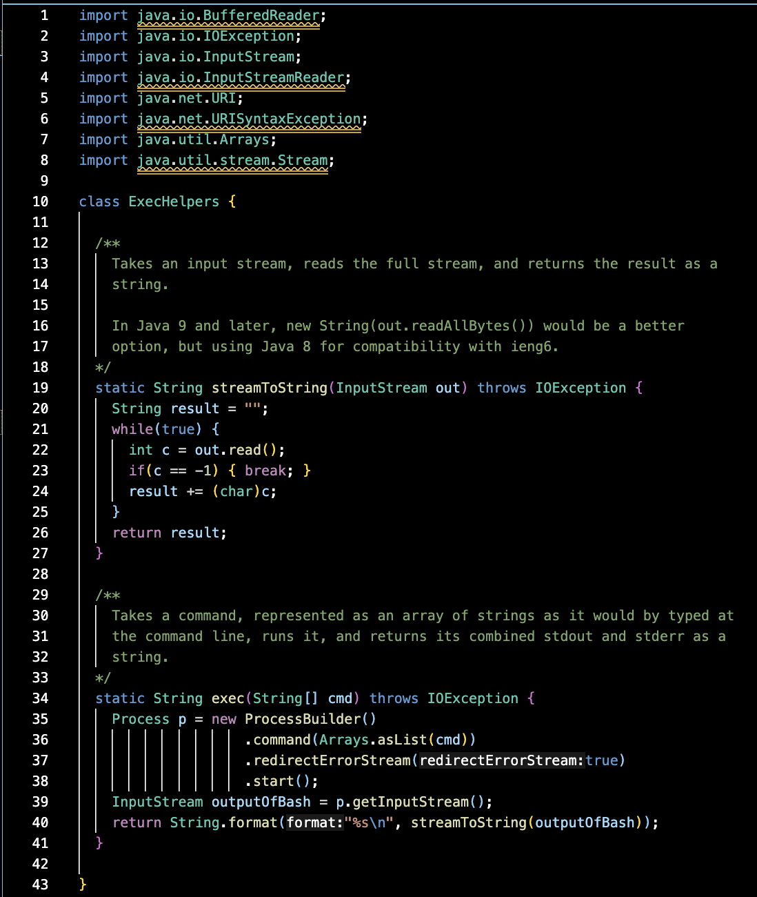
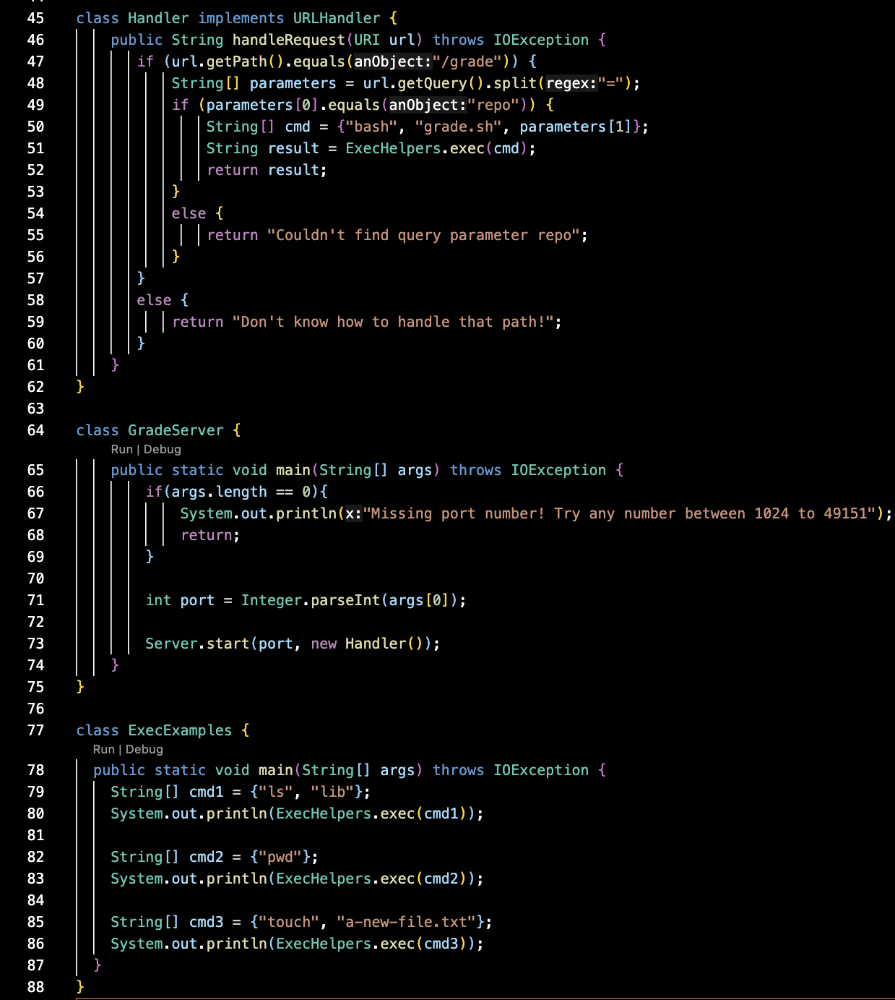
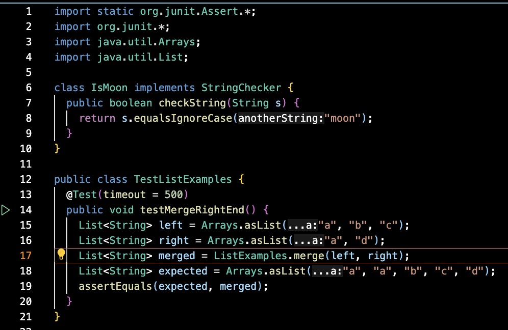
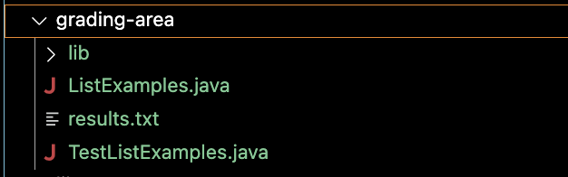
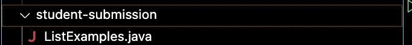

# Part 1 - Debugging Scenario
## Error in Code from Lab
### Anonymous 
Hi, there seems to be a strange error in my bash script for the grading script and I am struggling to find the source of it. I believe the error seems to stem from jUnit itself as that is what the error message seems to state but messing with the lib folder or even rewriting the jUnit access command doesn't seem to work. It also seems to affect the grading area
as even when tests are supposed to fail they are passing. In the tests I ran using `grade.sh` the first one works fine however the jUnit error still appears, and the next test also shows the error, but it should say "Test failed. F." rather than "Test passed. A.". Can someone help?

     
### Response from TA  
Hello, There are actually multiple errors in your grade.sh script. From the looks of it you seem to be working from a Macbook remember that for Windows paths for directories use ";" while for Mac they use ":". This error has nothing to do with the grading area however, your bash script is not recursively copying the grading-area file, I would recommend looking up the differnt options for the cp command.  
### Output from Student's fixed code  
 
The result of the fix the TA recommended. The bug was that for the path to the jUnit library the bash script used ";" which was for Windows terminal command. The problem here is that since this script is running on Mac it needs ":" in the filepath which is why the jUnit error was appearing. The next bug in the script is from the bash command `cp -r lib grading-area`. In order for the file to recursively copy it needs a capital R rather than the lowercase r, so the correct version would be `cp -R lib grading-area`. For this type of file I had the wrong cp option.   

---

The directory needed to access this file is:
`/Users/pedroarias/lab9/list-examples-grader`
  And the Files inside are: 
`GradeServer.java`             `TestListExamples.java`   `grade.sh`                `grading-area`            `lib`                     `student-submission`  
### Contents of Each File Before Bug Fix: 
`GradeServer.java` 

   `TestListExamples.java`

   `grade.sh`

   `grading-area` 

   `student-submission` 
  
### Command lines that Triggered the bug
 
### Description of how to Fix the Bug
To fix the bug in the code the main error is in the "grade.sh" file. As the TA said, the path to the jUnit directory needs to be fixed by changing the ";" to ":". The next fix in the code is changing the r to a captial r in the command `cp -r lib grading-area`. This allows for the grading-area to recursively copy properly and actually work.

# Reflection 
Something I learned from my lab expirence is that I found out how to work using vim and shortcuts within vim. While I had some knowledge of how to use a command terminal for running commands I had no idea I could actually look inside of them and edit them all within the command line itself. I found this to be cool as while sure it is harder to edit files in vim, if there ever was a case where I needed to do it well now I know how to do it and I find that amazing. Overall I thoroughly enjoyed the labs of this class. 
