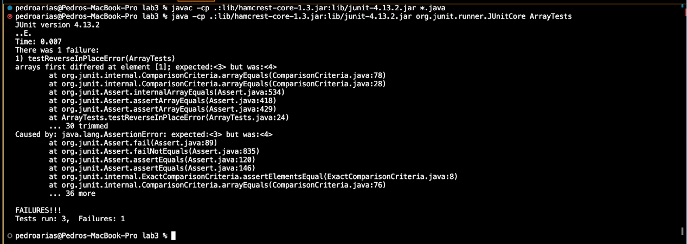
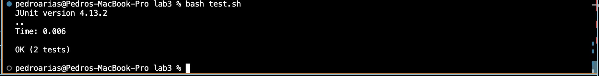
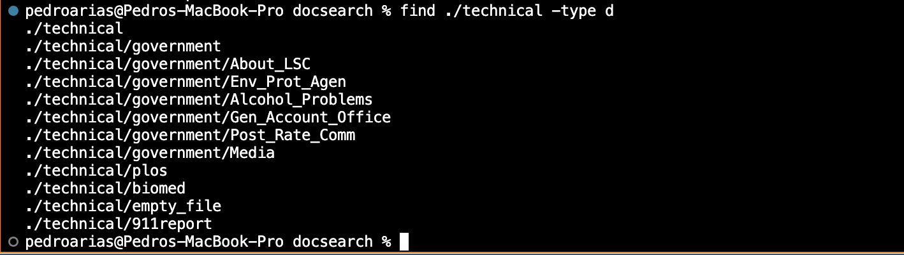
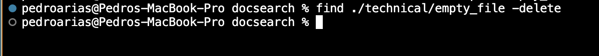
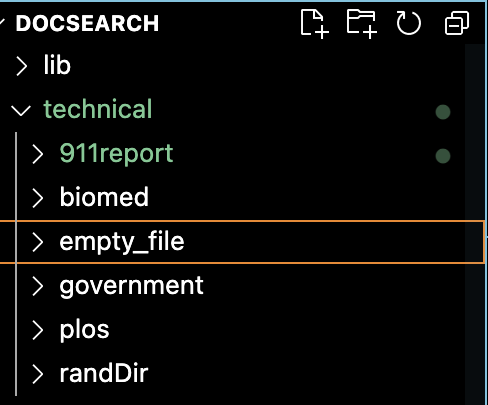
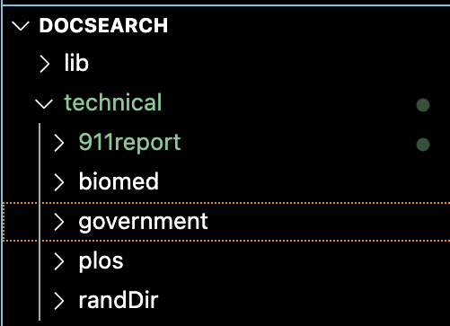
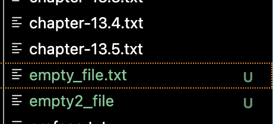
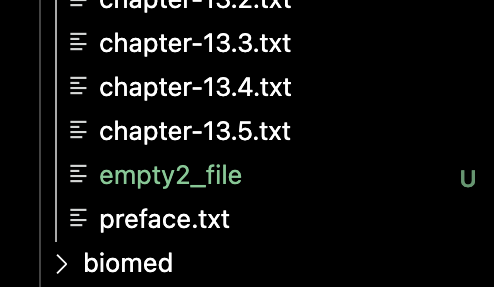

# Lab Report 3
## Part 1 - Bugs
---
Failure-inducing input for ArrayExamples.java as a JUnit Test: <br>
```
@Test
public void testReversedError() {
 int[] input1 = { 2,3};
assertArrayEquals(new int[]{3, 2}, ArrayExamples.reversed(input1));
 }
```
  Output: 
  
  <br>Input that doesn't induce a failure <br>
  ```
	@Test 
	public void testReverseInPlace() {
    int[] input1 = { 3 };
    ArrayExamples.reverseInPlace(input1);
    assertArrayEquals(new int[]{ 3 }, input1);
	}
```
Output: <br>

<br>
<br>
The bug in ArrayExamples.java causing failure-inducing inputs<br>

```
public class ArrayExamples {

  // Changes the input array to be in reversed order
  static void reverseInPlace(int[] arr) {
    for(int i = 0; i < arr.length; i += 1) {
      arr[i] = arr[arr.length - i - 1];
    }
  }
```
<br>
Bug-fixed code:
<br>

```
public class ArrayExamples {

  // Changes the input array to be in reversed order
  static void reverseInPlace(int[] arr) {
    for(int i = 0; i < arr.length; i += 1) {
      int temp =arr[i];
      arr[i] = arr[arr.length - i - 1];
      arr[arr.length-1]=temp;
    }
  }
```
>The error in the code is that the original code does not hold the value of the first value of the array. 
> In the second code it is fixed by creating a temporary variable to store the first value of the array so that it won't be deleted.
---
---
## Part 2 - Researching Commands.
---
### Find command-line options <br>
#### -name option<br>
To a directory:

To a file:

The -name option in the find command finds files and directories in a given directory with the specified name it is given.<br>
This is useful as it allows for the search of a specific file or file type in a directory, or even finding a directory in a workspace. 
><br>Source: https://www.geeksforgeeks.org/find-command-in-linux-with-examples/
---
#### -empty option <br>
To a directory:

To a file:

The -empty option in the find command finds empty files and directories in a specified directory.<br>
This is a useful option to find any empty file or directory that take up space.
><br>Source: https://www.geeksforgeeks.org/find-command-in-linux-with-examples/
---
#### -type option <br>
To a directory:<br>

To a file:

The -type option includes differnt arguments to search for specified file types.<br>
>-type f looks for files.<br>
>-type d searches for directories.<br>

This is a useful option to find either directories or files. It can also take in further arguments to search for specific directory names or file names/types<br>
><br>Source: https://tecadmin.net/linux-find-command-with-examples/
---
#### -delete option <br>
To a directory:

**Output(seen in file explorer):**<br>
 
<br>*Before(left) and after(right) command is run*<br><br>
**To a file:**

<br>**Result:**<br>
 
<br>*Before(left) and after(right) command is run*<br><br>
The -delete option deletes a specified directory or file. While nothing seems to occur at the command line level, looking through the file explorer or using ls it will show that the file or directory has been deletd
This is a useful becasue it allows for file deletion at the command line level. If there is a specific file or directory with a name someone wants to be deleted, this could be a way to mass delete files.<br>
><br>Source: find manual using command line.
  
